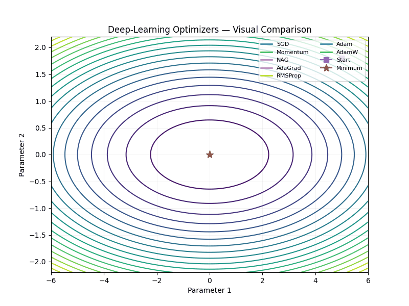
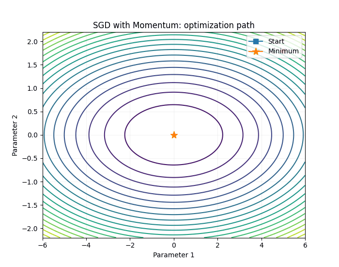
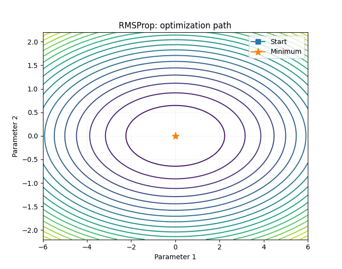
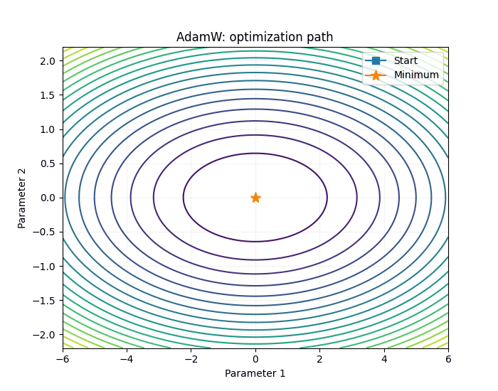

# Deep Learning Optimizers — Visualized

A beginner-friendly study project for understanding how common deep-learning optimizers update parameters.

## Optimizers covered

| Optimizer | Core idea |
|---|---|
| SGD | Uses the current gradient |
| SGD + Momentum | Uses gradient history / velocity |
| NAG | Looks ahead using momentum |
| AdaGrad | Accumulates squared gradients for adaptive step sizes |
| RMSProp | Uses an EWMA of squared gradients |
| Adam | First + second moments with bias correction |
| AdamW | Adam + decoupled weight decay |

## Visual comparison

The animation uses the same toy 2D loss surface and starting point for every optimizer so the update behavior can be compared visually.

> **Important:** This is an educational visualization, not a benchmark. Hyperparameters are selected for visualization and are not evidence that one optimizer is universally better than another.

## Individual animations

### SGD

### SGD with Momentum

### NAG

### AdaGrad

### RMSProp

### Adam

### AdamW

## Key formulas

### SGD
\[
\theta_{t+1} = \theta_t - \eta g_t
\]

### Momentum
\[
v_t = \beta v_{t-1} + (1-\beta)g_t
\]
\[
\theta_{t+1} = \theta_t - \eta v_t
\]

### NAG
Look ahead using momentum, then evaluate the gradient at the look-ahead point.

### AdaGrad
\[
G_t = G_{t-1} + g_t^2
\]
\[
\theta_{t+1}
=
\theta_t
-
\frac{\eta}{\sqrt{G_t+\epsilon}}g_t
\]

### RMSProp
\[
s_t = \rho s_{t-1} + (1-\rho)g_t^2
\]
\[
\theta_{t+1}
=
\theta_t
-
\frac{\eta}{\sqrt{s_t+\epsilon}}g_t
\]

### Adam
\[
m_t = \beta_1m_{t-1} + (1-\beta_1)g_t
\]
\[
v_t = \beta_2v_{t-1} + (1-\beta_2)g_t^2
\]

Bias correction:
\[
\hat m_t = \frac{m_t}{1-\beta_1^t},
\qquad
\hat v_t = \frac{v_t}{1-\beta_2^t}
\]

Update:
\[
\theta_{t+1}
=
\theta_t
-
\eta
\frac{\hat m_t}{\sqrt{\hat v_t}+\epsilon}
\]

### AdamW
Adam update + separately applied weight decay.

## Suggested study order

1. SGD
2. Momentum
3. NAG
4. AdaGrad
5. RMSProp
6. Adam
7. AdamW

## Quick memory tricks

- **SGD:** current gradient
- **Momentum:** remember direction
- **NAG:** look ahead
- **AdaGrad:** accumulate squared gradients
- **RMSProp:** forget old squared-gradient information gradually
- **Adam:** first + second moments
- **AdamW:** Adam + decoupled weight decay

## Code

The `code/` folder contains small NumPy implementations of every optimizer in this project.

These implementations are intentionally educational. Production frameworks such as PyTorch and TensorFlow should normally be used for real model training.

## Requirements

Python 3.x and NumPy/Matplotlib for the educational code and animation generation.

## License

MIT
